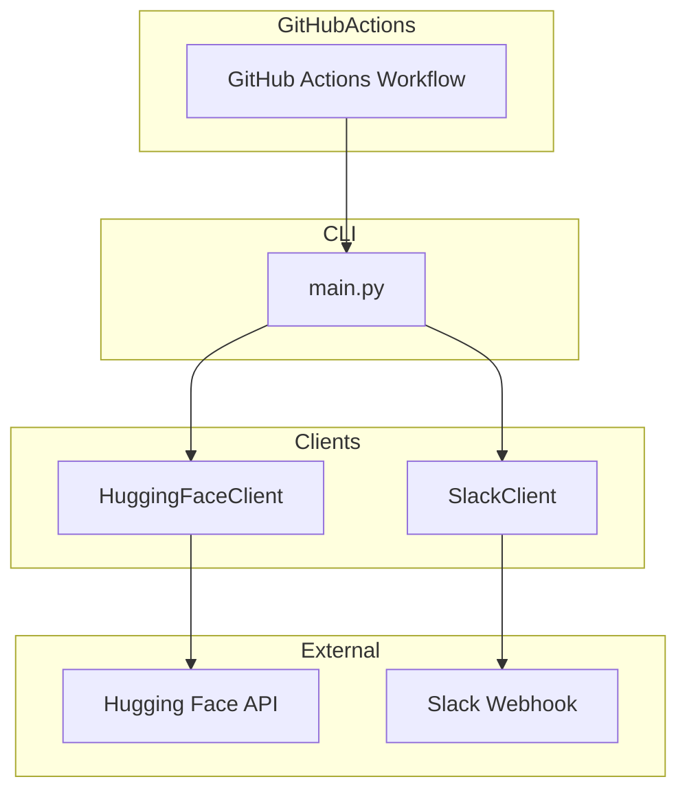

# Design Document - Paper Notificator

## Overview
**Purpose**: Hugging Face Daily Papersから週間人気論文Top5を取得し、Slackに投稿するCLIツール。

**Users**: 研究者、エンジニアがAI/ML分野の人気論文をチームと自動共有。

**Impact**: 毎日JST 10:00に自動実行され、Slackで情報共有を効率化。

### Goals
- Hugging Face Daily Papers APIから論文取得
- 週間Upvote数でソート、Top5を選択
- Slack Webhookでダイジェスト投稿
- GitHub Actionsで毎日定期実行

### Non-Goals
- GUIの提供
- 論文の全文取得や保存
- 複数Slackチャンネルへの同時投稿

## Architecture

### Architecture Pattern & Boundary Map



**Architecture Integration**:
- Selected pattern: Simple Script with API Clients
- Domain boundaries: HuggingFaceClient（論文取得）、SlackClient（通知）
- New components: HuggingFaceClient（旧ArxivClientを置換）

### Technology Stack

| Layer | Choice / Version | Role in Feature | Notes |
|-------|------------------|-----------------|-------|
| Runtime | Python 3.11+ | スクリプト実行 | GitHub Actions標準 |
| HTTP Client | requests 2.31+ | API通信 | |
| Configuration | python-dotenv 1.0+ | 環境変数読み込み | ローカル開発用 |
| CI/CD | GitHub Actions | 定期実行 | cron: UTC 01:00 |

## Requirements Traceability

| Requirement | Summary | Components | Interfaces |
|-------------|---------|------------|------------|
| 1.1-1.5 | 論文データ取得 | HuggingFaceClient | fetch_papers() |
| 2.1-2.4 | Slack通知 | SlackClient | post_message(), create_digest() |
| 3.1-3.2 | 設定管理 | main.py | 環境変数読み込み |
| 4.1-4.3 | GitHub Actions | .github/workflows/daily.yml | cron trigger |
| 5.1-5.2 | ドライラン | main.py | --dry-run フラグ |

## Components and Interfaces

| Component | Domain | Intent | Req Coverage | Key Dependencies |
|-----------|--------|--------|--------------|------------------|
| HuggingFaceClient | Data Fetch | HF APIからの論文取得 | 1.1-1.5 | requests (P0) |
| SlackClient | Notification | Slackへのメッセージ投稿 | 2.1-2.4 | requests (P0) |
| main.py | Orchestration | 全体フロー制御 | 3.1-3.2, 5.1-5.2 | HFClient, SlackClient (P0) |
| daily.yml | CI/CD | GitHub Actions定期実行 | 4.1-4.3 | - |

### Data Fetch Layer

#### HuggingFaceClient

| Field | Detail |
|-------|--------|
| Intent | Hugging Face Daily Papers APIから論文情報を取得 |
| Requirements | 1.1, 1.2, 1.3, 1.4, 1.5 |

**Responsibilities & Constraints**
- `https://huggingface.co/api/daily_papers` へのHTTPリクエスト
- JSONレスポンスの解析
- 週間フィルタリングとUpvoteソート

**Dependencies**
- External: requests — HTTP通信 (P0)
- External: Hugging Face API — 論文データソース (P0)

**Contracts**: Service [x]

##### Service Interface
```python
from datetime import datetime
from typing import TypedDict

class Paper(TypedDict):
    title: str
    link: str
    upvotes: int
    abstract: str
    published_at: str

class HuggingFaceClient:
    API_URL: str = "https://huggingface.co/api/daily_papers"
    
    def fetch_papers(self, top_n: int = 5, days: int = 7) -> list[Paper]:
        """
        週間人気論文を取得
        
        Args:
            top_n: 取得する論文数（デフォルト: 5）
            days: 過去何日間を対象とするか（デフォルト: 7）
        Returns:
            list[Paper]: Upvote数でソートされた論文リスト
        Raises:
            requests.RequestException: API通信エラー時
        """
        ...
```

### Notification Layer

#### SlackClient

| Field | Detail |
|-------|--------|
| Intent | Slack Webhookへのメッセージ投稿 |
| Requirements | 2.1, 2.2, 2.3, 2.4 |

**Contracts**: Service [x]

##### Service Interface
```python
class SlackClient:
    def __init__(self, webhook_url: str) -> None: ...
    
    def post_message(self, text: str) -> None:
        """Raises: requests.RequestException"""
        ...
    
    def create_digest(self, papers: list[Paper]) -> str:
        """
        Returns:
            str: フォーマット済みダイジェスト
            例:
            📚 Weekly Top Papers from Hugging Face
            
            1. Paper Title
               🔗 https://...
               👍 123 upvotes
               > Abstract excerpt...
        """
        ...
```

### CI/CD Layer

#### .github/workflows/daily.yml

| Field | Detail |
|-------|--------|
| Intent | GitHub Actionsによる定期実行 |
| Requirements | 4.1, 4.2, 4.3 |

**Workflow Definition**
```yaml
name: Daily Paper Notification
on:
  schedule:
    - cron: '0 1 * * *'  # UTC 01:00 = JST 10:00
  workflow_dispatch:  # 手動実行も可能

jobs:
  notify:
    runs-on: ubuntu-latest
    steps:
      - uses: actions/checkout@v4
      - uses: actions/setup-python@v5
        with:
          python-version: '3.11'
      - name: Install dependencies
        run: |
          python -m venv .venv
          source .venv/bin/activate
          pip install -r requirements.txt
      - name: Run notificator
        env:
          SLACK_WEBHOOK_URL: ${{ secrets.SLACK_WEBHOOK_URL }}
        run: |
          source .venv/bin/activate
          python main.py
```

## Data Models

### Domain Model

```python
class Paper(TypedDict):
    title: str        # 論文タイトル
    link: str         # arXiv/HF URL
    upvotes: int      # Upvote数
    abstract: str     # 概要
    published_at: str # 公開日時 (ISO 8601)
```

## Error Handling

### Error Strategy
- **Fail Fast**: 環境変数未設定時は起動時に終了
- **Graceful Exit**: API通信エラー時はエラーログを出力して終了

### Error Categories and Responses
- **Configuration Error**: SLACK_WEBHOOK_URL未設定 → エラーメッセージ出力、exit(1)
- **Network Error**: HF/Slack API通信失敗 → エラーログ出力、exit(1)

## Testing Strategy

### Unit Tests
- `HuggingFaceClient.fetch_papers()`: モックAPI応答テスト
- `SlackClient.create_digest()`: ダイジェスト生成ロジックテスト

### Integration Tests
- `main.py --dry-run`: 標準出力への出力確認

## File Structure

```
arxiv-notificator/
├── .github/
│   └── workflows/
│       └── daily.yml
├── .venv/
├── main.py
├── huggingface_client.py
├── slack_client.py
├── requirements.txt
└── README.md
```
