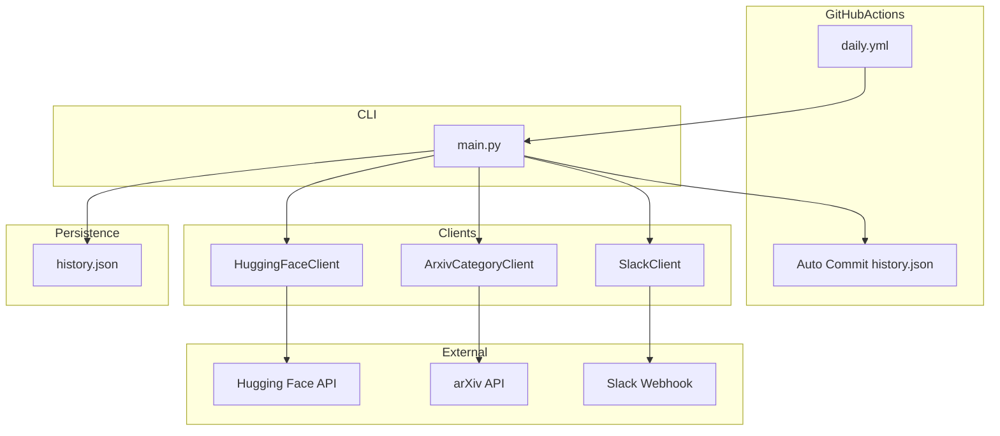

# Design Document - Category Filtering and History Tracking

## Overview
**Purpose**: arXivカテゴリによる論文フィルタリングと、history.jsonによる重複排除機能を追加。

**Users**: Agent/LLM関連の最新論文を効率的に収集したい研究者・エンジニア。

**Impact**: 関心領域に絞った論文配信と、重複のない新鮮な情報提供を実現。

### Goals
- arXiv APIを使用した論文カテゴリ取得
- 指定カテゴリでのフィルタリング（デフォルト: Agent関連）
- history.jsonによる送信済み論文の追跡
- GitHub Actionsでの自動履歴更新

### Non-Goals
- arXiv以外の論文ソースへの対応
- 複雑なデータベースによる履歴管理

## Architecture

### Updated Architecture



## Requirements Traceability

| Requirement | Summary | Components | Interfaces |
|-------------|---------|------------|------------|
| 1.1-1.5 | カテゴリフィルタリング | ArxivCategoryClient, HuggingFaceClient | get_categories(), filter_by_category() |
| 2.1-2.5 | 重複排除 | HistoryManager | load(), save(), is_sent(), add() |
| 3.1-3.3 | GitHub Actions自動更新 | daily.yml | git commit step |

## Components and Interfaces

### New Component: ArxivCategoryClient

| Field | Detail |
|-------|--------|
| Intent | arXiv APIから論文のカテゴリ情報を取得 |
| Requirements | 1.1, 1.2, 1.3, 1.4, 1.5 |

```python
class ArxivCategoryClient:
    API_URL = "http://export.arxiv.org/api/query"
    
    def get_categories(self, arxiv_ids: list[str]) -> dict[str, list[str]]:
        """
        論文IDからカテゴリを取得
        
        Args:
            arxiv_ids: arXiv論文IDのリスト (e.g., ["2501.12345", "2501.67890"])
        Returns:
            dict: {paper_id: [category1, category2, ...]}
        """
        ...
```

### New Component: HistoryManager

| Field | Detail |
|-------|--------|
| Intent | 送信済み論文IDの永続化管理 |
| Requirements | 2.1, 2.2, 2.3, 2.4, 2.5 |

```python
class HistoryManager:
    def __init__(self, filepath: str = "history.json"):
        ...
    
    def load(self) -> list[dict]:
        """history.jsonから履歴を読み込み"""
        ...
    
    def is_sent(self, paper_id: str) -> bool:
        """指定IDが送信済みかチェック"""
        ...
    
    def add(self, paper_ids: list[str]) -> None:
        """新しい論文IDを追加"""
        ...
    
    def cleanup(self, days: int = 30) -> None:
        """古いエントリを削除"""
        ...
    
    def save(self) -> None:
        """history.jsonに保存"""
        ...
```

### Updated: HuggingFaceClient

```python
# 追加メソッド
def extract_arxiv_id(self, paper: Paper) -> str | None:
    """論文リンクからarXiv IDを抽出"""
    ...
```

### Updated: main.py

```python
# 新しいCLI引数
parser.add_argument(
    "--categories",
    type=str,
    default="cs.AI,cs.MA,cs.CL",
    help="Comma-separated arXiv categories to filter"
)
```

## Data Models

### history.json

```json
{
  "sent_papers": [
    {"id": "2501.12345", "sent_at": "2026-01-05"},
    {"id": "2501.12346", "sent_at": "2026-01-05"}
  ]
}
```

## Updated GitHub Actions Workflow

```yaml
# daily.yml に追加
- name: Commit history.json
  run: |
    git config --local user.email "github-actions[bot]@users.noreply.github.com"
    git config --local user.name "github-actions[bot]"
    git add history.json
    git diff --staged --quiet || git commit -m "Update history.json [skip ci]"
    git push
```

## Error Handling

- **arXiv API失敗**: カテゴリ取得失敗時は論文を除外せず含める（フォールバック）
- **history.json不在**: 新規作成して続行
- **history.json破損**: 空リストで初期化、警告ログ出力

## Testing Strategy

### Unit Tests
- `ArxivCategoryClient.get_categories()`: モックAPIレスポンステスト
- `HistoryManager`: load/save/is_sent/add/cleanupのテスト
- `HuggingFaceClient.extract_arxiv_id()`: ID抽出ロジックテスト

### Integration Tests
- フルフロー: 論文取得→カテゴリフィルタ→重複排除→Slack投稿→履歴更新
